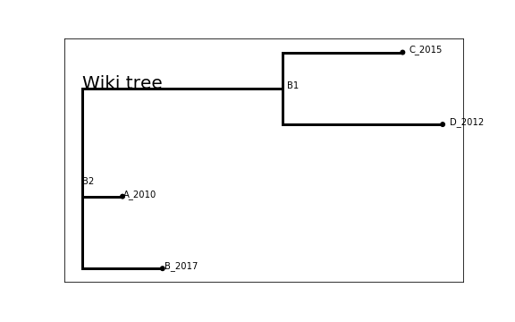

# Input Formatting

Dependencies: `numpy`, `pandas`, `matplotlib`. All of these are pretty standard libraries and available in Anaconda.

## Metadata File(s)
An additional `csv` is sometimes available. Load this as a `pandas dataframe`, and do referencing from there on.

## Tree File Format
`Baltic` was written to accept BEAST MCC trees in mind, so any `.tre` file or `.nex` file needs to be wrangled to look like a BEAST MCC tree. There are 2 blocks which need for be formatted: the taxa block, and the tree block.

### Taxa Block

This is a list of the taxa/virus/tip names, `Taxa1`, `Taxa2`...etc.

```
Begin taxa;
    Dimensions ntax=300;
        Taxlabels
        Taxa1
        Taxa2
        ...
        Taxa300
;
End;
```

Baltic names *must* have a date at the end, in the format `yyyy-mm-dd`, `yyyy-mm` or `yyyy`, delimited from the rest of the name by some special character, (e.g. "`_`" or "`|`"). If there's no date to begin with, give the sequence name an arbitrary date. Some examples of valid names:

```
A/virusname1/virus_id1_2015-05
A/virusname1/virus_id1_2015-5-31
A/virusname1/virus_id1_2015-05-31
A/virusname1/virus_id1_2015-05-01
A/virusname1/virus_id1_2015

A/virusname1/virus_id1|2015-05
A/virusname1/virus_id1|2015-5-31
A/virusname1/virus_id1|2015-05-31
A/virusname1/virus_id1|2015-05-01
A/virusname1/virus_id1|2015
```

`baltic` uses these dates to compute a decimal year (e.g. 2007-07-01 gets converted to 2007.5) and plots the node positions by decimal year, so that a time-scale can be shown on the x-axis as well if the tree really is a BEAST tree. If the input tree is not a BEAST TREE, this is a dummy operation that does not affect the displayed tree topology.

### "Trees" Block
This is the block containing the actual tree itself, in Newick format.

```
begin trees;
    tree TREE1 = [&R] <start of newick format...>
```

Altogether, the following `Nexus` format is a valid format. Note that the node labels, `[&branch="something"]`, are optional. If this is, for instance, a RAXML tree with bootstrap labels at the nodes, then it would be something like `[&label=93]`, or something like that.

```
#NEXUS
begin taxa;
    dimensions ntax=4;
	Taxlabels
	A_2010
	B_2017
	C_2015
	D_2012
;
end;

begin trees;
    tree TREE1 = [&R] (A_2010:0.1,B_2017:0.2,(C_2015:0.3,D_2012:0.4)[&branch="B1"]:0.5)[&branch="B2"];
end;
```

Produces a tree in Baltic tree like:


